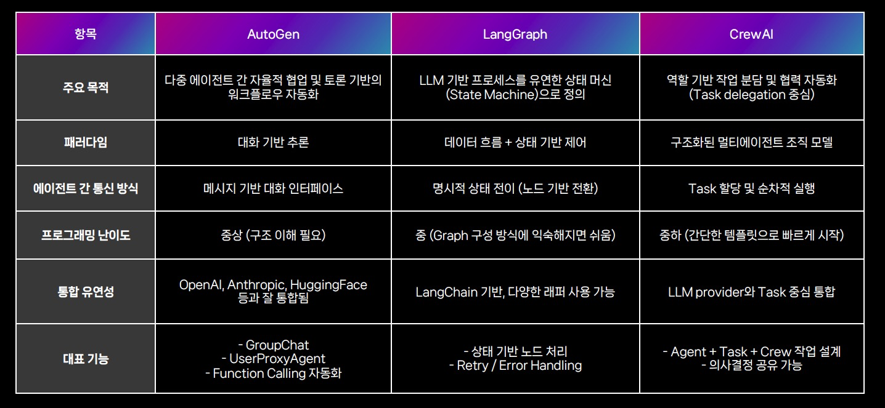

- [NAVER Cloud AI DevDay 리뷰: AI 에이전트와 트렌드](https://yozm.wishket.com/magazine/detail/3247/)
  - 모델에 대한 깊이 있는 이해와 직접적인 튜닝 경험 중요

- ['모두의 AI'에 1조245억 투입…"챗GPT의 95% 구현이 목표"](https://www.hankyung.com/article/2025061841281)
  - 자국 공용 AI 개발에 투자